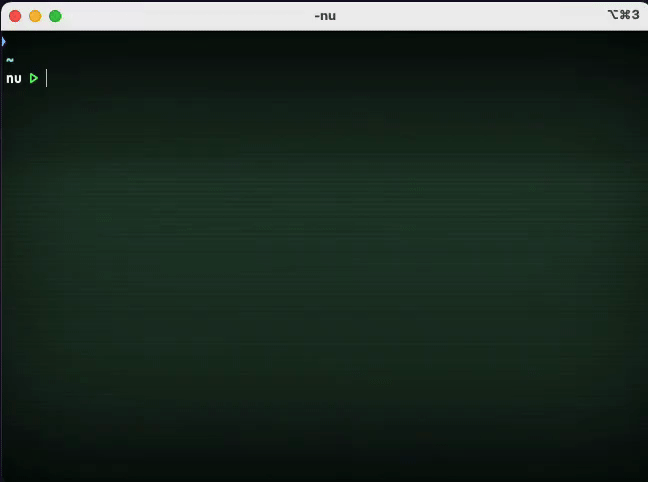

# aio - Streamlined AI Terminal Interactions

Welcome to the README for the `aio` command line tool – your gateway to seamless communication with AI engines via the terminal. This tool streamlines interactions with AI APIs, including the OpenAI API, and conveniently formats the results using integrated markdown formatting. Whether you're seeking information, generating content, or experimenting with AI, `aio` has you covered.

<p align="center">
  
</p>

## 0.8 BREAKING CHANGES

The default credentials path has changed from `~/.config/aio/creds.yml` to `~/.cache/aio/creds.yml`.

## Table of Contents

- [aio - Streamlined AI Terminal Interactions](#aio---streamlined-ai-terminal-interactions)
  - [0.8 BREAKING CHANGES](#08-breaking-changes)
  - [Table of Contents](#table-of-contents)
  - [NEW : Run code from code blocks](#new--run-code-from-code-blocks)
  - [Introduction](#introduction)
  - [Installation](#installation)
  - [Install from crates.io](#install-from-cratesio)
    - [Install from Github releases](#install-from-github-releases)
    - [Install from source](#install-from-source)
  - [Usage](#usage)
  - [Arguments](#arguments)
  - [Configuration](#configuration)
  - [Credentials](#credentials)
  - [Examples](#examples)
  - [Aliases](#aliases)
  - [Contributing](#contributing)

## NEW : Run code from code blocks

You can now run code from code blocks using the flag `-r|--run`

<p align="center">
  
</p>

## Introduction

The `aio` command line tool is designed to simplify your interactions with AI engines by providing an intuitive interface directly within your terminal. Harness the power of large language models such as the OpenAI API without leaving your command line environment.

## Installation

## Install from crates.io

You can now install aio from crates.io using the following command:

```
cargo install aio-cli
```

The program will be installed to your `~/.cargo/bin` directory.

### Install from Github releases

To install `aio`, follow these steps:

1. Download the [latest release](https://github.com/glcraft/aio/releases/latest) based on you operating system and architecture.

2. Extract the downloaded archive.

3. (optional) Add the path of the directory where the binary was extracted to your `PATH`. Write this in your `~/.bashrc` or `~/.zshrc` (or `~/.zshenv`):
   ```sh
   PATH=/path/to/aio/bin:$PATH
   ```
   or you can copy the `aio` executable into your `/usr/local/bin`.
   ```sh
   # sudo may be required
   sudo cp aio /usr/local/bin
   ```

### Install from source

To install `aio`, follow these steps:

1. **Prerequisites**: Make sure you have Rust installed on your system. If not, you can [install Rust](https://www.rust-lang.org/tools/install).

2. **Clone Repository**: Clone the `aio` repository to your local machine:

   ```sh
   git clone https://github.com/yourusername/aio.git
   ```

3. **Build and Install**: Navigate to the `aio` directory and build the tool:

   ```sh
   cd aio
   cargo install --path .
   ```

## Usage

Using `aio` is straightforward. In your terminal, simply invoke the tool with appropriate arguments to communicate with AI engines and receive formatted responses.

```sh
aio --engine openai:ask "Write an informative article about space exploration."
```

## Arguments

The `aio` command line tool supports the following arguments:

- `--config_path`: Path to the configuration file. Default is `~/.config/aio/config.yaml`.

- `--creds_path`: Path to the credentials file. Default is `~/.config/aio/creds.yaml`.

- `-e|--engine <ENGINE>`: Name of the AI engine to use. You can optionally append a custom prompt name from the [configuration file](#configuration) (e.g., `openai:command`).
  List of ENGINEs:
  - `openai`: OpenAI API
  - `from-file`: Read prompts from a file. Useful to debug or test a file.

- `-f|--formatter <FORMATTER>`: Formatter to use. Possible FORMATTERs: 
  - `markdown`: Parse the text response as markdown and format it in the console.
  - `raw`: Doesn't parse the response text. Just displays the raw text response.
  
  By default the formatter is set to `markdown` if in terminal/tty, otherwise `raw`.

- `-r|--run <METHOD>`: Run code block if the language is supported. Possible METHODs:
  - `no`: Doesn't run anything.
  - `ask`: Ask to run code.
  - `force`: Run code without asking.
  
  By default, `run` is set to `no`.

- `input`: User text prompt that will be used for interaction with the AI engine.

- `-h|--help`: Display the help message.

- `-V|--version`: Display the version.

Note : `aio` can now read input from stdin instead of from parameters.

## Configuration

To fine-tune your AI interactions, you can create and modify a configuration file in YAML format. This file allows you to define prompts, messages, and parameters for different AI engines. Refer to the [Configuration Details](./docs/CONFIG.md) file for more information.

## Credentials

Secure your API credentials by storing them in a credentials file. This ensures a safe and convenient way to authenticate with AI engines. Credentials can be set up using the `creds.yaml` file. Refer to the [Credentials Details](./docs/CREDS.md) file for more information.

## Examples

Here are a few examples to get you started:

1. Generate a creative story using the OpenAI engine:
   ```sh
   aio --engine openai "Once upon a time in a distant galaxy..."
   ```

2. Ask for a command to extract a compressed archive:
   ```sh
   aio --engine openai:command "Extract a compressed archive `./archive.tar.gz` to the current directory."
   ```

## Aliases

The whole command can be long to type in. You can use aliases in your shell to shorten the command.
```sh
alias ask='aio --engine openai:ask'
alias command='aio --engine openai:command'

ask "Write an informative article about space exploration."
command "Extract a compressed archive `./archive.tar.gz` to the current directory."
```

## Contributing

We welcome contributions from the community to enhance the `aio` project. If you're interested in making improvements, fixing issues, or adding new features, feel free to contribute.

By contributing to `aio`, you become part of an open-source community working to improve AI interactions in the terminal.

For more detailed guidelines, please refer to our [Contribution Guide](./CONTRIBUTING.md).

We appreciate your contributions and look forward to collaborating with you!
